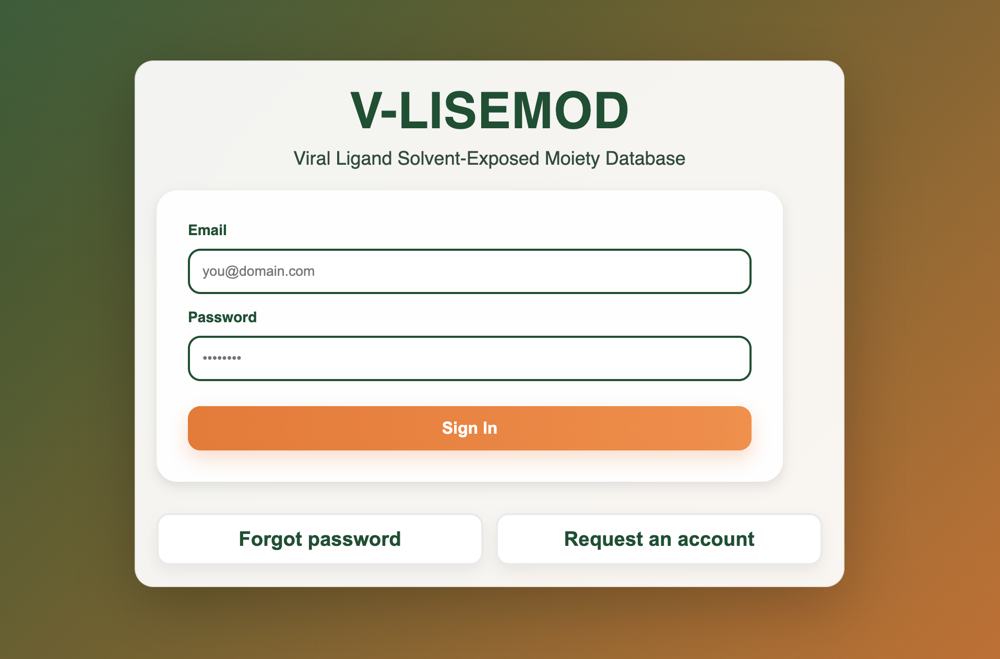
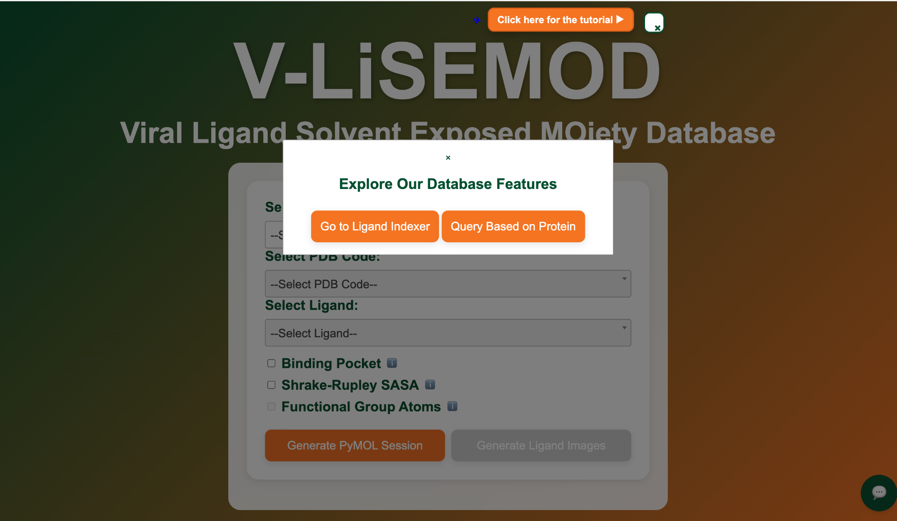
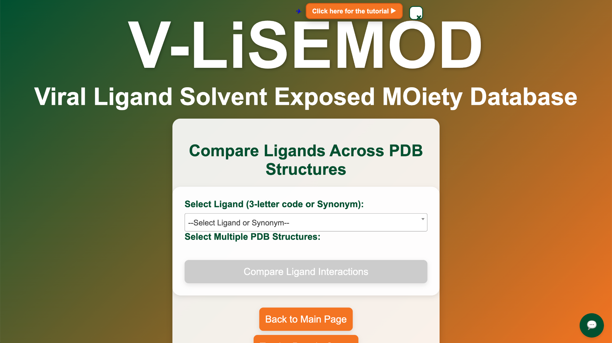
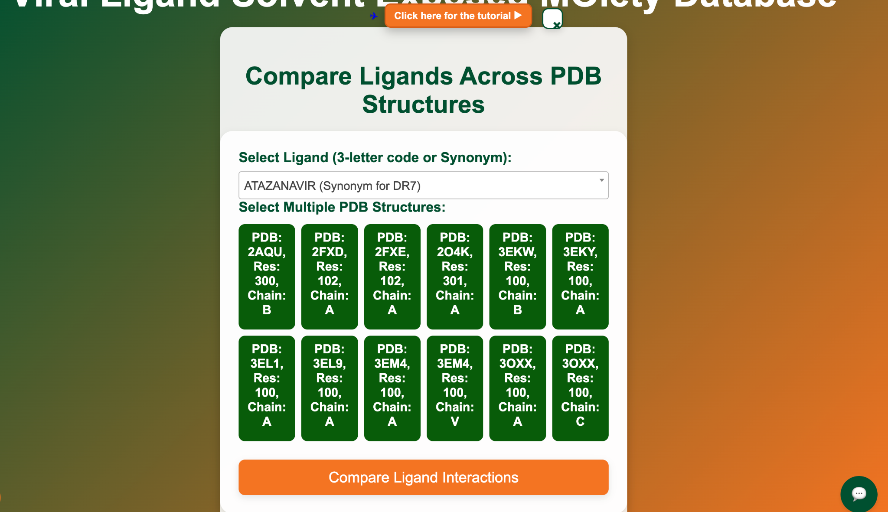
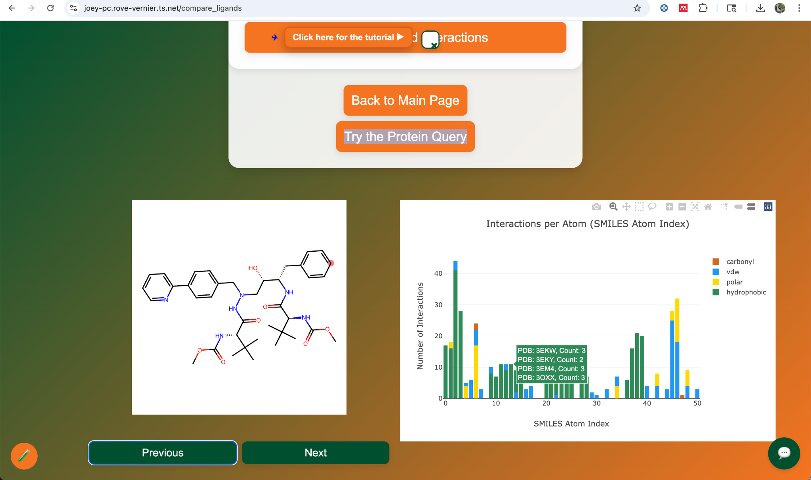
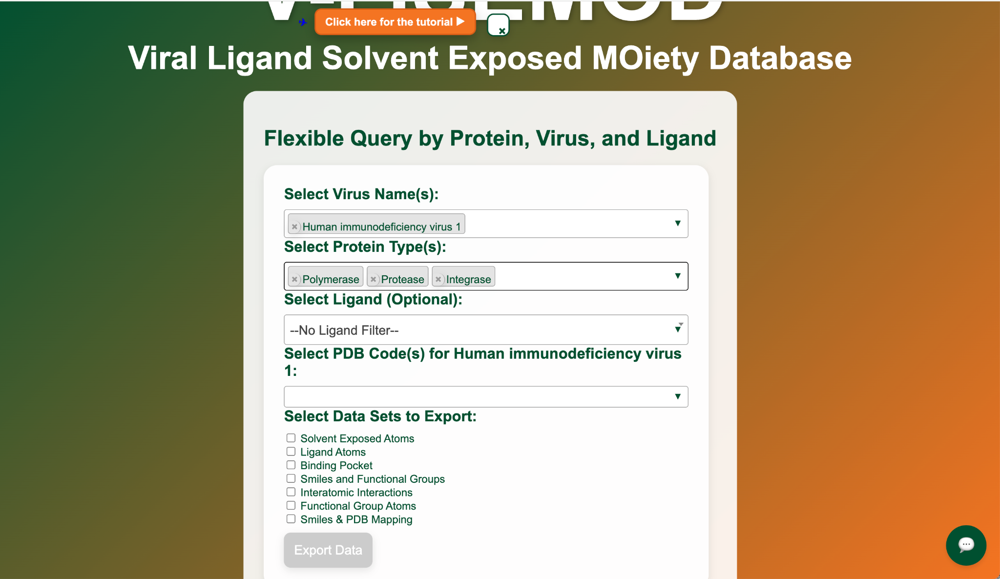

# V-LiSEMOD — Viral Ligand Solvent-Exposed Moiety Database (Public Showcase)

> Explore curated **viral protein–ligand co-crystals** from the PDB, compare interactions across structures, export analysis-ready datasets, and launch **PyMOL** sessions for visualization. Built to support digital drug discovery and training.

[▶ Open V-LiSEMOD](https://vlisemod.com) · [Video: Ligand Analysis](https://youtu.be/C6jttCjKIxc) · [Video: Protein Query](https://youtu.be/-nm4yCq8AIM) · [Video: Home Page](https://www.youtube.com/watch?v=0tyw-ZfJxkk)

---

  

## Table of Contents
- [Overview](#overview)
- [Core Modules](#core-modules)
  - [Home (PyMOL Session Builder)](#home-pymol-session-builder)
  - [Ligand Analysis / Indexer](#ligand-analysis--indexer)
  - [Query by Protein (Flexible Exports)](#query-by-protein-flexible-exports)
- [Tutorial Videos](#tutorial-videos)
- [How It Works (High-Level Pipeline)](#how-it-works-high-level-pipeline)
- [Screenshots](#screenshots)
- [Data & Tools](#data--tools)
- [Roadmap](#roadmap)
- [Privacy & Access](#privacy--access)
- [Credits](#credits)
- [License](#license)
- [Contact](#contact)

---

## Overview
**V-LiSEMOD** is a training and research companion for **viral protein–ligand** structures. Every entry originates from an RCSB **PDB co-crystal**, filtered and normalized so you can:
- browse ligand-bound viral targets (e.g., HIV-1, SARS-CoV-2, HPV),
- compare one **ligand across many PDBs**, and
- export analysis-ready tables (SASA, interaction fingerprints, functional groups, etc.).

> This repository is **docs only**; application code and database are private.

---

## Core Modules

### Home (PyMOL Session Builder)
Start on the landing page and select **Virus → PDB → Ligand → Chain**. Optional overlays:
- **Binding Pocket:** atoms within 5 Å (yellow surface)
- **Shrake-Rupley SASA:** solvent-exposed ligand atoms (highlighted)
- **Functional-group atoms:** shown when data is available

Click **Generate PyMOL Session** to download a ready-to-open `.pse` with your selections.

_See video:_ **Home Page Walkthrough** → https://www.youtube.com/watch?v=0tyw-ZfJxkk

  

---

### Ligand Analysis / Indexer
Pick a **ligand (3-letter code or synonym)**, then select multiple **co-crystal PDBs** to compare. V-LiSEMOD renders:
- **Distribution donut** of interaction types,
- **Distance vs. interaction scatter,**
- **Stacked bars** per PDB (polar, vdw, hydrophobic, etc.),
- **Per-atom bar chart** (which ligand atoms interact most).

Use the **carousel** to step through charts while the **2D molecule** stays visible, making it easy to map bars back to atoms. Designed to quickly reveal **modifiable R-groups**, **adaptable pockets**, and opportunities for optimization.

_See video:_ **Ligand Analysis Walkthrough** → https://youtu.be/C6jttCjKIxc

   
   
  

---

### Query by Protein (Flexible Exports)
Filter by **Virus name(s)**, **Protein type(s)** (e.g., protease, integrase, polymerase, spike), and optional **Ligand**. Select relevant **PDBs** and export one or more datasets:

- **Solvent-exposed atoms (SASA)**
- **Ligand atoms**
- **Binding pocket atoms**
- **SMILES & functional groups**
- **Interatomic interactions (Arpeggio)**
- **Functional-group atom lists**
- **SMILES↔PDB mapping**

_See video:_ **Protein Query Walkthrough** → https://youtu.be/-nm4yCq8AIM

  

---

## Tutorial Videos
- 🎥 **Home Page:** https://www.youtube.com/watch?v=0tyw-ZfJxkk  
- 🎥 **Ligand Analysis / Indexer:** https://youtu.be/C6jttCjKIxc  
- 🎥 **Protein Query / Exports:** https://youtu.be/-nm4yCq8AIM  

---

## How It Works (High-Level Pipeline)
At a glance:
1. **Ingest PDB/CIF** from RCSB for target viruses; organize by virus/strain.  
2. **Detect ligand-bearing co-crystals**, exclude trivial ligands (water/ions).  
3. Fetch **SMILES**, identify **functional groups** (SMARTS via RDKit), and map group atoms.  
4. Generate **ligand–residue interactions** (Arpeggio) and map **atom IDs** from PDB/CIF.  
5. Compute **SASA** (Shrake-Rupley) to flag **solvent-exposed ligand atoms**.  
6. Build analysis tables: **Ligand_Atoms_Smiles**, **Functional_Group_Atoms**, **Arpeggio_Contacts**, **Covalent_Noncovalent**, etc.  
7. Surface the data through the modules above; launch **PyMOL** with user-selected overlays.

> Notes: The **PROTAC Builder** (linker design) is being split into a separate tool/repo.

---

## Screenshots
- `assets/vlisemod-login.png` — Login  
- `assets/vlisemod-home-modal.png` — Home modal (quick links)  
- `assets/vlisemod-indexer-blank.png` — Ligand Indexer (initial)  
- `assets/vlisemod-indexer-selected.png` — Ligand Indexer (PDBs chosen)  
- `assets/vlisemod-indexer-charts.png` — Charts + 2D molecule  
- `assets/vlisemod-protein-query.png` — Query by Protein  
- `assets/vlisemod-comparison.png` — Example bar chart + 2D molecule

---

## Data & Tools
- **Primary source:** RCSB **PDB** co-crystals (ligand-bound).  
- **Visualization:** **PyMOL** (3D), **PoseView** (2D diagrams), in-app NGL viewer.  
- **Interaction fingerprints:** **Arpeggio**.  
- **Cheminformatics:** **RDKit** for SMILES, functional groups, substructure mapping.  
- **SASA:** **Shrake-Rupley** algorithm for solvent-exposed atoms.  
- **Synonyms:** RCSB ligand pages for drug/ligand name variants.

---

## Roadmap
- Move **PROTAC Builder** into its own public showcase (link here when live).
- Expand virus/protein coverage and add more curated synonyms.
- Session exports (CSV/Parquet bundles) and per-query share links.

---

## Privacy & Access
- Sign-in required for full functionality (request access from the login page).
- This repository is **documentation only**; production datasets and code remain private.

---

## Credits
- **Lead:** Joseph-Michael Schulz  
- **Thanks:** structural biology & cheminformatics communities; tooling authors of **PyMOL**, **RDKit**, **Arpeggio**, **PoseView**.

## License
Documentation in this repository is released under the **MIT License**.  
The production application source code and databases are private.

## Contact
Questions, access requests, or collaboration ideas?  
**Mindful Diabetes Inc.** · hello@mindfuldiabetes.org

---

**Open V-LiSEMOD:** https://vlisemod.com
